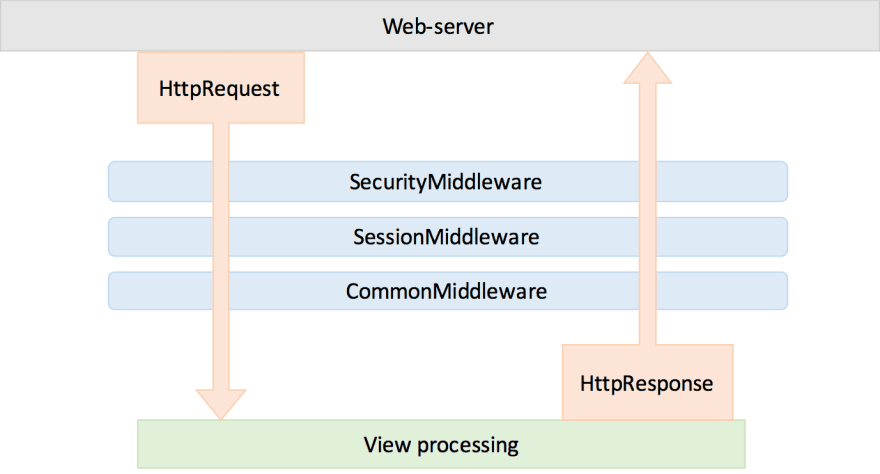
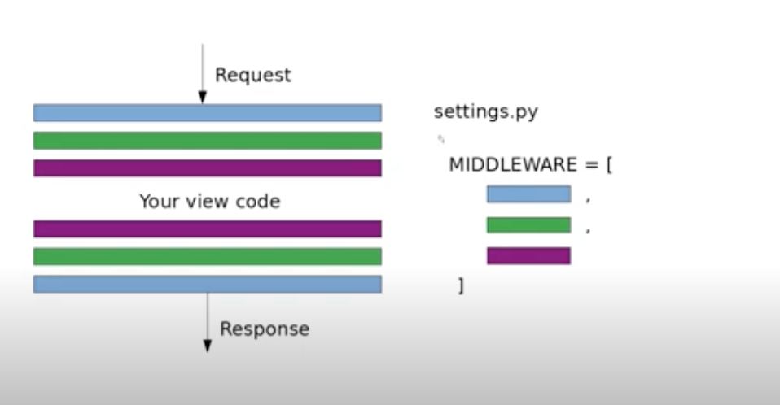

### Middleware life cycle

### Middleware in settings

# Examples

## SecurityMiddleware
-   SECURE_CONTENT_TYPE_NOSNIFF
- SECURE_CROSS_ORIGIN_OPENER_POLICY
- SECURE_HSTS_INCLUDE_SUBDOMAINS
- SECURE_HSTS_PRELOAD
- SECURE_HSTS_SECONDS
- SECURE_REDIRECT_EXEMPT
- SECURE_REFERRER_POLICY
- SECURE_SSL_HOST
- SECURE_SSL_REDIRECT

## UpdateCacheMiddleware
